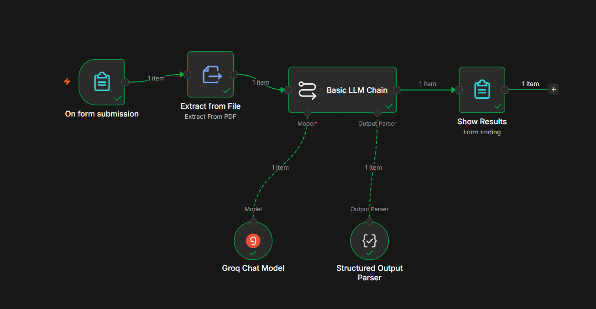

# 🤖 AI Career Copilot

### Your personal AI-powered job application assistant, built with n8n

Upload your resume, paste any job description, and instantly get a full career report — match score, tailored resume, skill-gap plan, interview prep, and a personalized cover letter.


---

## 📖 Overview

**AI Career Copilot** is an end-to-end n8n workflow that acts as a smart career assistant. A user opens a public web form, enters the job details, and uploads their resume as a PDF. An AI model reads both, evaluates how well the resume fits the role, and generates a complete, tailored report — displayed instantly on a styled results page.

It turns a simple "how good is my resume for this job?" question into an actionable, AI-generated career toolkit.

---

## 🖼️ Workflow Structure



On form submission → Extract from File → Basic LLM Chain → Show Results
│
├─ Groq Chat Model (Llama 3.3 70B)
└─ Structured Output Parser (JSON)
✅ Change it to this (note the ``` lines added around the diagram):

<pre>

🖼️ Workflow Structure
Workflow Diagram

On form submission  →  Extract from File  →  Basic LLM Chain  →  Show Results
                                                   │
                                                   ├─ Groq Chat Model (Llama 3.3 70B)
                                                   └─ Structured Output Parser (JSON)
</pre>
## ⚙️ How It Works

| # | Node | Role |
|---|------|------|
| 1 | **On form submission** | Public web form — collects Company, Role, Job URL, Job Description, and a resume PDF upload |
| 2 | **Extract from File** | Extracts plain text from the uploaded PDF so the AI can read it |
| 3 | **Basic LLM Chain** | Sends the resume text + job details to the AI and returns a structured analysis |
| — | ↳ **Groq Chat Model** | The LLM engine (Llama 3.3 70B, served via Groq for speed) |
| — | ↳ **Structured Output Parser** | Forces the AI to respond in strict, reliable JSON |
| 4 | **Show Results** | Renders a polished HTML report page for the user |

---

## ✨ Features

- 🎯 **Match Score (0–100)** with a Strong / Moderate / Weak verdict and apply recommendation
- ✅ **Skill Analysis** — matching skills, missing/weak skills, and missing ATS keywords
- 📝 **Tailored Professional Summary** rewritten for the specific job
- ✍️ **Rewritten Resume Bullets** — quantified and keyword-aligned (before ➜ after)
- 📚 **Skill-Gap Prep Plan** with actionable steps and priorities
- 🚀 **Recommended Next Project** matched to your skills and the target role
- 🎤 **Interview Prep** — likely questions with coaching talking points
- ✉️ **Personalized Cover Letter** ready to send

---

## 🛠️ Tech Stack

- **[n8n](https://n8n.io/)** — workflow automation platform
- **Groq API + Llama 3.3 70B** — large language model
- **PDF Text Extraction** — document parsing
- **Structured JSON Output Parsing** — reliable, machine-readable AI responses
- **HTML / CSS** — modern, card-based results page
- **Prompt Engineering** — grounded prompts that use only real resume content

---

## 🚀 Getting Started

1. **Download** `AI Career Copilot.json` from this repository.
2. In n8n, go to **⋯ menu → Import from File** and select the JSON.
3. Add your **Groq** credential (create a free key at [console.groq.com](https://console.groq.com)).
4. **Activate** the workflow.
5. Open the **Form Trigger URL** and share it — no login required for users.

---

## 🧠 Key Concepts Demonstrated

- LLM orchestration and prompt engineering
- Structured output parsing for reliable AI data
- Document processing (PDF → text)
- End-to-end automation: form input → AI reasoning → rendered output

---

## 📌 Roadmap / Possible Enhancements

- [ ] Email the report to the user
- [ ] Log every analysis to a database / spreadsheet
- [ ] Downloadable PDF report
- [ ] Experience-level targeting (Intern / Entry / Mid) for more accurate scoring
- [ ] Empty/unreadable-PDF safeguard

---


**Built by Vijay Rudraraju**

⭐ If you find this useful, consider starring the repo!

</div>
